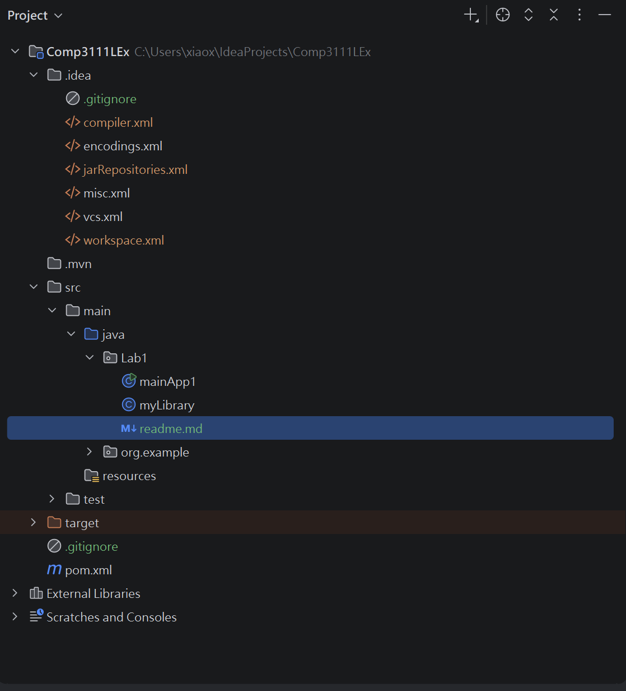
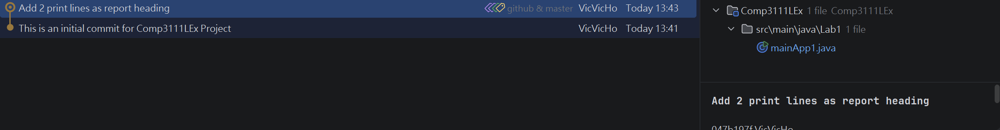
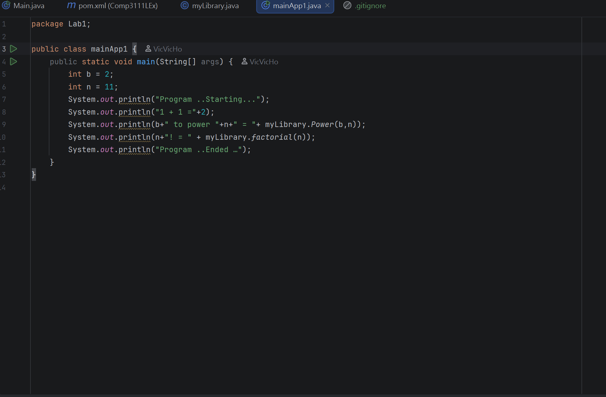

This is my Lab1 in Comp3111 - Software Engineering.
1. I have learnt the way to build a Java Project in IntelliJ.
2. I have successfully shared my first IntelliJ/Git shared project source with others.

Here is the screenshot of my 1st lab project in IntelliJ:

